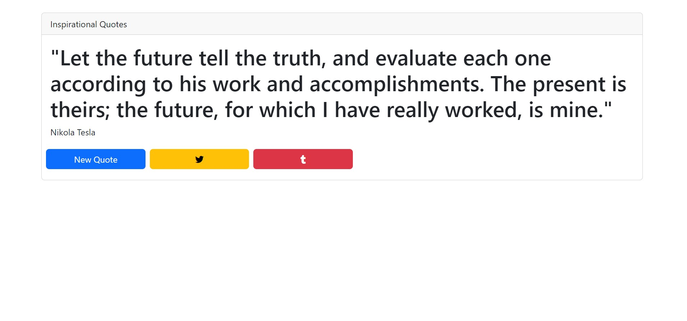

# RAndom-Quote-Machine

Random Quote Machine (React)
The Random Quote Machine is a web application built using React. 
It generates random quotes for users and displays them on the screen. 
This project utilizes React components, state management, and API integration to fetch and display quotes.

Features
Random Quotes: The application fetches random quotes from an external API and displays them to the user.
Quote Author: Each quote is accompanied by the name of the author.
New Quote Button: Clicking the "New Quote" button generates a new random quote.
Tweet Quote: Users can share their favorite quotes on Twitter by clicking the "Tweet Quote" button.
Demo
You can see a live demo of the Random Quote Machine project here.

Installation
To run the project locally, follow these steps:

Clone the repository:

bash
Copy code
git clone https://github.com/Aneal07/Random-Quote-Machine.git
Install the dependencies:

bash
Copy code
cd Random-Quote-Machine
npm install
Start the development server:

sql
Copy code
npm start
Open your web browser and navigate to http://localhost:3000 to view the application.

Usage
Click the "New Quote" button to generate a new random quote.
To share a quote on Twitter, click the "Tweet Quote" button.
Contributing
Contributions are welcome! If you find any issues or have suggestions for improvements, please open an issue or submit a pull request.

License
This project is licensed under the MIT License.

Acknowledgements
The quotes used in this project were sourced from ExampleQuotes.com.
The project was built with the help of the Create React App tool.
Feel free to modify and customize the README to accurately describe your React project. Provide relevant information about the project's features,
installation instructions, usage guidelines, acknowledgments, and licensing details.
